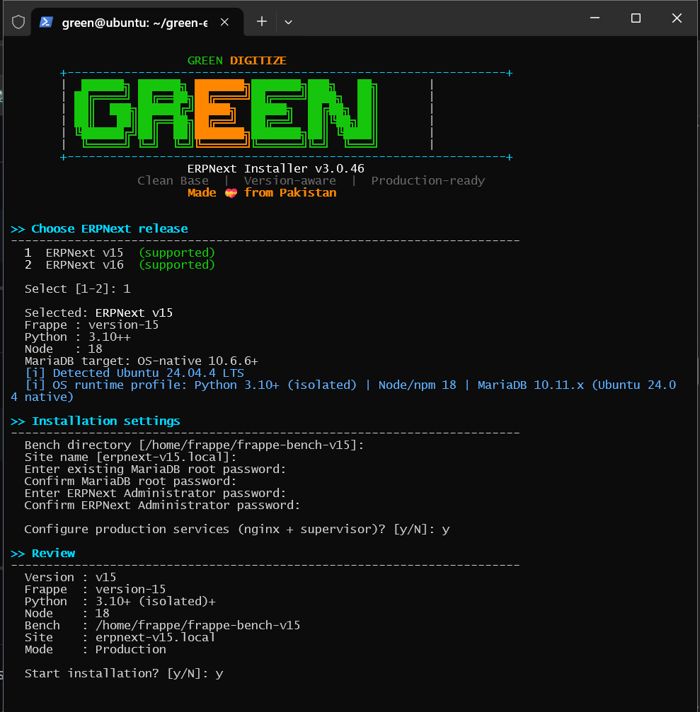

<p align="center">
  
</p>


# Green Digitize — ERPNext Easy Installation

> **A simple, step-by-step installation guide for ERPNext.**
>
> Built for users who want a clean ERPNext installation on a fresh Ubuntu server or VirtualBox VM, with SSH-based administration and clear recovery guidance.

---

## 🚀 Installation Overview


    Fresh Ubuntu VM / Server
    Update System
    Connect Through SSH
    Clone Green Digitize Repository
    Run Installer
    Choose ERPNext Version
    Configure Database & Site
    Install ERPNext
    Production Setup
    Open ERPNext in Browser
    Verify Installation


---

# 🖥️ 1. Compatibility

## 1.1 Recommended Environment

For a new ERPNext installation, use a **fresh Ubuntu VM or server**.

| Component | Recommendation |
|---|---|
| Operating System | Ubuntu 22.04 LTS or newer supported release |
| CPU | 2+ cores recommended |
| RAM | 4 GB minimum for basic testing; more is recommended for production |
| Disk | 40 GB+ recommended; 100 GB is a comfortable VM size |
| Access | SSH or local terminal with sudo access |
| User | Non-root Linux user with sudo privileges |

> **Important:** Resource requirements depend on the number of users, background jobs, reports, attachments and other workloads. Production systems should be sized for the expected workload.

## 1.2 ERPNext Version

This guide supports ERPNext v15 and v16.

The installer in this repository may offer both ERPNext versions, so always select the version you intentionally plan to deploy.

> Do not install multiple major ERPNext versions into the same server environment. Use a separate VM/server for a different major version when possible.

---

# 🛠️ 2. Installation

## 2.1 Update and Upgrade the System

Run:

```bash
sudo apt update && sudo apt -y upgrade
```

When the upgrade finishes, reboot the server:

```bash
sudo reboot
```

Reconnect through SSH after the server comes back online.

---

## 2.2 No Need to Panic About Creating a New User

The installer will prompt you to create a new user and automatically configure the required permissions for that user.

<p align="center">
  
</p>

---

## 2.3 Clone the Green Digitize Installer Repository

Clone this repository:

```bash
git clone https://github.com/greendigitize/green-easy-erpnext-installation.git
```

Enter the directory:

```bash
cd green-easy-erpnext-installation
```

---

## 2.4 Make the Installer Executable

Run:

```bash
chmod +x green_erpnext_installer.sh
```

---

## 2.5 Start the Installer

Run:

```bash
source green_erpnext_installer.sh
```

The installer will guide you through the setup interactively.

> **Do not run the installer as root.**

---

# 📊 3. Choose ERPNext Version

When the installer displays its version menu, choose the version you want to install.


For an interactive menu, this will normally appear as a numbered choice. Select the number shown beside **Version 16**.

---

# ⚙️❓4. Installation Questions

The exact prompts can vary with installer revisions, but the normal flow includes configuration for the following items.

## 4.1 Frappe Bench

The installer creates a Frappe Bench environment where the framework, ERPNext and the site are managed.

A typical bench directory is:

```text
frappe-bench
```

## 4.2 Site Name

The site is the ERPNext database/site identity.

For local testing you may use a name such as:

```text
erpnext.local
```

For a real deployment, use the domain name you have configured for the server.

## 4.3 Administrator Password

Set a strong ERPNext **Administrator** password and store it securely.

This password is for logging into ERPNext. It is not the same thing as the MariaDB database root password.

## 4.4 Database Passwords

The installation process may configure MariaDB and ask for database credentials.

Keep all database credentials safe. They are important for maintenance, backup, recovery and migration work.

---

# 📥5. Install ERPNext

When the installer asks whether ERPNext should be installed, choose the affirmative option.

The installer will then fetch ERPNext and install it into the Frappe Bench environment.

During this stage, allow the commands to finish. Large installations can take significant time depending on CPU, RAM, disk speed and network bandwidth.

---

# 🧰6. Redis connection problem

From the Bench directory, use the appropriate Bench setup commands for your installation:

```bash
cd ~/frappe-bench
bench setup redis
bench setup socketio
bench setup supervisor
sudo supervisorctl reload
```

Then inspect service status:

```bash
sudo supervisorctl status
```

Avoid changing Redis ports randomly. First confirm which ports and services the current Bench configuration expects.

</details>

---

# 💾 7. Backup and Recovery

ERPNext is recoverable when the important data has been preserved.

The key rule is:

> **Application files can often be rebuilt; deleted database/site data cannot be recreated automatically.**

A damaged application environment does not necessarily mean that all business data is lost. The database and site data may remain intact and can sometimes be used during a rebuild or restoration.

However, if the database, site directory, files or backups have been deleted or corrupted, the original data may not be recoverable without a valid backup.

## 11.1 Before Destructive Repair

Before removing an existing ERPNext installation, preserve:

- Database backup
- Site files
- Private files
- Public files
- Configuration information
- Encryption/secrets where required by your deployment

## 7.2 Rebuild Concept

A typical recovery flow is:

```text
Existing ERPNext problem
        │
        ▼
Create / verify backups
        │
        ▼
Determine whether the problem is application or data related
        │
        ├───────────────┐
        ▼               ▼
Application issue    Data issue
        │               │
        ▼               ▼
Repair/rebuild      Restore valid backup
        │               │
        └───────┬───────┘
                ▼
        Run migrations/checks
                │
                ▼
          Start services
                │
                ▼
          Verify ERPNext
```

## 7.3 Important Recovery Warning

Do not assume that reinstalling ERPNext will automatically bring back:

- users
- passwords
- invoices
- customers
- accounting data
- attachments
- customizations

Those depend on the database, site files and backups being preserved and restored correctly.

---

# 🆕 8. Fresh Reinstallation

A completely fresh reinstall should be treated as a **destructive operation** unless you have confirmed that all required data is backed up.

Recommended sequence:

```text
1. Stop and assess
2. Take backups
3. Confirm backup integrity
4. Document site/database information
5. Remove or rebuild only what is necessary
6. Reinstall ERPNext
7. Restore data when appropriate
8. Run migrations
9. Verify services
10. Verify login and business data
```

Never delete the old environment first and investigate backups later.

---

# 🧩 9. Additional Apps

The safest first installation path is:

```text
ERPNext v16
   ↓
Verify ERPNext
   ↓
Take a backup
   ↓
Install additional apps one at a time
   ↓
Verify after each major change
```

Third-party apps can have their own compatibility requirements. Test them separately instead of treating every additional app as part of the base ERPNext installation.

---

# 🔃 10. Clean Installation Checklist

Use this checklist before declaring the installation complete:

- [ ] Ubuntu is updated
- [ ] SSH access works
- [ ] Non-root sudo user is being used
- [ ] Repository cloned successfully
- [ ] Installer is executable
- [ ] ERPNext v16 selected intentionally
- [ ] Database credentials stored securely
- [ ] ERPNext Administrator password stored securely
- [ ] Site created successfully
- [ ] ERPNext installed successfully
- [ ] Supervisor/Nginx/Redis services are healthy where used
- [ ] Browser login works
- [ ] `bench --site <site> list-apps` works
- [ ] Initial backup has been created

---


# 🌱 11. Green Digitize

**Green Digitize** provides this repository as an easy starting point for deploying ERPNext with a clear installation path and practical recovery guidance.

The goal of this project is to make the installation process easier to understand, easier to repeat and easier to recover when something goes wrong.

---

## 📌 Important Notes

- This repository is an installation aid; always review the installer before using it on a production server.
- ERPNext, Frappe Framework and third-party applications have their own release cycles and compatibility requirements.
- Always maintain verified backups for production systems.
- Do not expose database credentials or secrets in GitHub.

---

## 📚 Official Resources

- [ERPNext Documentation](https://docs.erpnext.com)
- [Frappe Framework Documentation](https://docs.frappe.io)
- [ERPNext on GitHub](https://github.com/frappe/erpnext)
- [Frappe Framework on GitHub](https://github.com/frappe/frappe)

---

**Green Digitize — ERPNext Easy Installation**

Simple installation. Clear steps. Safer recovery.
